# 369 Algo - Trading Web Application Architecture

## System Architecture Overview

```mermaid
flowchart TB
    %% User Interface Layer
    subgraph "Frontend (React + TypeScript)"
        UI[User Interface]
        subgraph "Pages"
            Dashboard[Dashboard]
            Portfolio[Portfolio]
            Trading[Trading]
            MarketData[Market Data]
            News[Financial News]
            Watchlist[Watchlist]
            Settings[Settings]
            Login[Login/Register]
        end
        
        subgraph "Components"
            Navbar[Navbar]
            Sidebar[Sidebar]
            Charts[TradingView Charts]
            Forms[Forms & Inputs]
            Cards[Data Cards]
            Tables[Data Tables]
        end
        
        subgraph "Contexts & Hooks"
            AuthContext[Authentication Context]
            ThemeContext[Theme Context]
            useTheme[useTheme Hook]
        end
        
        subgraph "Services"
            APIService[API Service]
            WebSocketService[WebSocket Service]
        end
    end
    
    %% API Gateway Layer
    subgraph "Backend (FastAPI + Python)"
        subgraph "Main Application"
            MainApp[Main FastAPI App]
            Middleware[CORS, Security, Logging]
        end
        
        subgraph "Authentication & Security"
            JWT[JWT Authentication]
            PasswordHash[Password Hashing]
            SecurityMiddleware[Security Middleware]
        end
        
        subgraph "API Routers"
            AuthRouter[Auth Router]
            TradingRouter[Trading Router]
            PortfolioRouter[Portfolio Router]
            MarketDataRouter[Market Data Router]
            NewsRouter[News Router]
            WatchlistRouter[Watchlist Router]
            SettingsRouter[Settings Router]
            BrokerRouter[Broker Router]
        end
        
        subgraph "Business Logic Services"
            NewsService[News Service]
            MarketDataService[Market Data Service]
            PortfolioService[Portfolio Service]
            TradingService[Trading Service]
            BrokerService[Broker Service]
            CacheService[Cache Service]
            TimeSeriesService[Time Series Service]
        end
        
        subgraph "Data Models"
            UserModel[User Model]
            TradeModel[Trade Model]
            PortfolioModel[Portfolio Model]
            WatchlistModel[Watchlist Model]
            NewsModel[News Model]
            MarketDataModel[Market Data Model]
        end
    end
    
    %% External Services Layer
    subgraph "External APIs & Services"
        subgraph "Market Data Providers"
            AlphaVantage[Alpha Vantage API]
            YahooFinance[Yahoo Finance API]
            NSEIndia[NSE India API]
            BSEIndia[BSE India API]
        end
        
        subgraph "News Providers"
            NewsAPI[News API]
            FinancialNews[Financial News Sources]
        end
        
        subgraph "Broker APIs"
            Zerodha[Zerodha API]
            AngelOne[Angel One API]
            Upstox[Upstox API]
        end
    end
    
    %% Data Storage Layer
    subgraph "Data Storage"
        PostgreSQL[(PostgreSQL Database)]
        Redis[(Redis Cache)]
        FileStorage[File Storage]
    end
    
    %% Infrastructure Layer
    subgraph "Infrastructure & Deployment"
        Docker[Docker Containers]
        DockerCompose[Docker Compose]
        Environment[Environment Variables]
        Logging[Application Logging]
        Monitoring[Health Monitoring]
    end
    
    %% Data Flow Connections
    UI --> APIService
    APIService --> MainApp
    MainApp --> AuthRouter
    MainApp --> TradingRouter
    MainApp --> PortfolioRouter
    MainApp --> MarketDataRouter
    MainApp --> NewsRouter
    MainApp --> WatchlistRouter
    MainApp --> SettingsRouter
    MainApp --> BrokerRouter
    
    %% Service Connections
    AuthRouter --> JWT
    AuthRouter --> PasswordHash
    TradingRouter --> TradingService
    PortfolioRouter --> PortfolioService
    MarketDataRouter --> MarketDataService
    NewsRouter --> NewsService
    WatchlistRouter --> PortfolioService
    BrokerRouter --> BrokerService
    
    %% External API Connections
    MarketDataService --> AlphaVantage
    MarketDataService --> YahooFinance
    MarketDataService --> NSEIndia
    MarketDataService --> BSEIndia
    NewsService --> NewsAPI
    NewsService --> FinancialNews
    BrokerService --> Zerodha
    BrokerService --> AngelOne
    BrokerService --> Upstox
    
    %% Database Connections
    AuthRouter --> UserModel
    TradingRouter --> TradeModel
    PortfolioRouter --> PortfolioModel
    WatchlistRouter --> WatchlistModel
    NewsRouter --> NewsModel
    MarketDataRouter --> MarketDataModel
    
    UserModel --> PostgreSQL
    TradeModel --> PostgreSQL
    PortfolioModel --> PostgreSQL
    WatchlistModel --> PostgreSQL
    NewsModel --> PostgreSQL
    MarketDataModel --> PostgreSQL
    
    %% Cache Connections
    CacheService --> Redis
    NewsService --> CacheService
    MarketDataService --> CacheService
    PortfolioService --> CacheService
    
    %% Infrastructure Connections
    MainApp --> Docker
    PostgreSQL --> Docker
    Redis --> Docker
    Environment --> DockerCompose
    
    %% Styling
    classDef frontend fill:#e1f5fe,stroke:#01579b,stroke-width:2px
    classDef backend fill:#f3e5f5,stroke:#4a148c,stroke-width:2px
    classDef external fill:#fff3e0,stroke:#e65100,stroke-width:2px
    classDef storage fill:#e8f5e8,stroke:#1b5e20,stroke-width:2px
    classDef infrastructure fill:#fce4ec,stroke:#880e4f,stroke-width:2px
    
    class UI,Dashboard,Portfolio,Trading,MarketData,News,Watchlist,Settings,Login,Navbar,Sidebar,Charts,Forms,Cards,Tables,AuthContext,ThemeContext,useTheme,APIService,WebSocketService frontend
    class MainApp,Middleware,JWT,PasswordHash,SecurityMiddleware,AuthRouter,TradingRouter,PortfolioRouter,MarketDataRouter,NewsRouter,WatchlistRouter,SettingsRouter,BrokerRouter,NewsService,MarketDataService,PortfolioService,TradingService,BrokerService,CacheService,TimeSeriesService,UserModel,TradeModel,PortfolioModel,WatchlistModel,NewsModel,MarketDataModel backend
    class AlphaVantage,YahooFinance,NSEIndia,BSEIndia,NewsAPI,FinancialNews,Zerodha,AngelOne,Upstox external
    class PostgreSQL,Redis,FileStorage storage
    class Docker,DockerCompose,Environment,Logging,Monitoring infrastructure
```

## API Endpoints Architecture

```mermaid
flowchart TD
    %% API Gateway
    subgraph "API Gateway (FastAPI)"
        Gateway[FastAPI Gateway]
        CORS[CORS Middleware]
        AuthMiddleware[Authentication Middleware]
        RateLimit[Rate Limiting]
    end
    
    %% Authentication Endpoints
    subgraph "Authentication (/api/auth)"
        AuthLogin[POST /login]
        AuthRegister[POST /register]
        AuthMe[GET /me]
        AuthLogout[POST /logout]
    end
    
    %% Trading Endpoints
    subgraph "Trading (/api/trading)"
        TradingPlace[POST /place-trade]
        TradingHistory[GET /history]
        TradingCancel[POST /cancel-trade]
        TradingStatus[GET /status]
    end
    
    %% Portfolio Endpoints
    subgraph "Portfolio (/api/portfolio)"
        PortfolioHoldings[GET /holdings]
        PortfolioAdd[POST /add-holding]
        PortfolioRemove[POST /remove-holding]
        PortfolioValue[GET /value]
    end
    
    %% Market Data Endpoints
    subgraph "Market Data (/api/market)"
        MarketQuote["GET /quote/symbol"]
        MarketSearch[GET /search]
        MarketIndices[GET /indices]
        MarketStatus[GET /status]
        MarketIndian["GET /indian/*"]
    end
    
    %% News Endpoints
    subgraph "News (/api/news)"
        NewsLatest[GET /latest]
        NewsCategories[GET /categories]
        NewsSearch[GET /search]
        NewsIndian[GET /indian-markets]
        NewsGlobal[GET /global-markets]
    end
    
    %% Watchlist Endpoints
    subgraph "Watchlist (/api/watchlist)"
        WatchlistGet[GET /]
        WatchlistAdd[POST /add]
        WatchlistRemove[POST /remove]
    end
    
    %% Broker Endpoints
    subgraph "Broker (/api/broker)"
        BrokerConnect[POST /connect]
        BrokerStatus[GET /status]
        BrokerOrders[GET /orders]
    end
    
    %% Settings Endpoints
    subgraph "Settings (/api/settings)"
        SettingsGet[GET /]
        SettingsUpdate[PUT /update]
        SettingsPreferences[GET /preferences]
    end
    
    %% Data Flow
    Gateway --> CORS
    Gateway --> AuthMiddleware
    Gateway --> RateLimit
    
    Gateway --> AuthLogin
    Gateway --> AuthRegister
    Gateway --> AuthMe
    Gateway --> AuthLogout
    
    Gateway --> TradingPlace
    Gateway --> TradingHistory
    Gateway --> TradingCancel
    Gateway --> TradingStatus
    
    Gateway --> PortfolioHoldings
    Gateway --> PortfolioAdd
    Gateway --> PortfolioRemove
    Gateway --> PortfolioValue
    
    Gateway --> MarketQuote
    Gateway --> MarketSearch
    Gateway --> MarketIndices
    Gateway --> MarketStatus
    Gateway --> MarketIndian
    
    Gateway --> NewsLatest
    Gateway --> NewsCategories
    Gateway --> NewsSearch
    Gateway --> NewsIndian
    Gateway --> NewsGlobal
    
    Gateway --> WatchlistGet
    Gateway --> WatchlistAdd
    Gateway --> WatchlistRemove
    
    Gateway --> BrokerConnect
    Gateway --> BrokerStatus
    Gateway --> BrokerOrders
    
    Gateway --> SettingsGet
    Gateway --> SettingsUpdate
    Gateway --> SettingsPreferences
    
    %% Styling
    classDef gateway fill:#e3f2fd,stroke:#1565c0,stroke-width:2px
    classDef auth fill:#fce4ec,stroke:#c2185b,stroke-width:2px
    classDef trading fill:#e8f5e8,stroke:#388e3c,stroke-width:2px
    classDef portfolio fill:#fff3e0,stroke:#f57c00,stroke-width:2px
    classDef market fill:#f3e5f5,stroke:#7b1fa2,stroke-width:2px
    classDef news fill:#e0f2f1,stroke:#00796b,stroke-width:2px
    classDef watchlist fill:#f1f8e9,stroke:#689f38,stroke-width:2px
    classDef broker fill:#fce4ec,stroke:#ad1457,stroke-width:2px
    classDef settings fill:#e8eaf6,stroke:#3949ab,stroke-width:2px
    
    class Gateway,CORS,AuthMiddleware,RateLimit gateway
    class AuthLogin,AuthRegister,AuthMe,AuthLogout auth
    class TradingPlace,TradingHistory,TradingCancel,TradingStatus trading
    class PortfolioHoldings,PortfolioAdd,PortfolioRemove,PortfolioValue portfolio
    class MarketQuote,MarketSearch,MarketIndices,MarketStatus,MarketIndian market
    class NewsLatest,NewsCategories,NewsSearch,NewsIndian,NewsGlobal news
    class WatchlistGet,WatchlistAdd,WatchlistRemove watchlist
    class BrokerConnect,BrokerStatus,BrokerOrders broker
    class SettingsGet,SettingsUpdate,SettingsPreferences settings
```

## Technology Stack Summary

### Frontend
- **React 18** with TypeScript
- **React Router DOM** for navigation
- **Styled Components** for styling
- **React Icons** for UI icons
- **TradingView Charts** for financial charts

### Backend
- **FastAPI** with Python 3.13
- **SQLAlchemy** ORM
- **Pydantic** for data validation
- **Python-Jose** for JWT authentication
- **Passlib** for password hashing
- **HTTPX** for async HTTP requests

### Database
- **PostgreSQL** as primary database
- **Redis** for caching and sessions
- **SQLAlchemy** for database operations

### External Integrations
- **Alpha Vantage API** for US market data
- **News API** for financial news
- **NSE India API** for Indian markets
- **BSE India API** for Indian markets
- **Yahoo Finance API** as fallback

### Deployment
- **Docker** containerization
- **Docker Compose** for local development
- **Environment-based configuration**
- **CORS support** for cross-origin requests

### Security Features
- **JWT-based authentication**
- **Password hashing with bcrypt**
- **CORS middleware**
- **Rate limiting support**
- **Input validation and sanitization**

This architecture provides a scalable, maintainable, and secure foundation for your 369 Algo trading application with clear separation of concerns and modern development practices.
